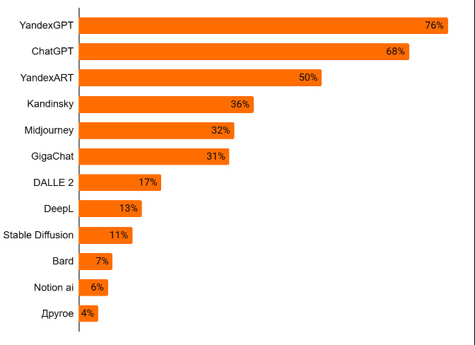
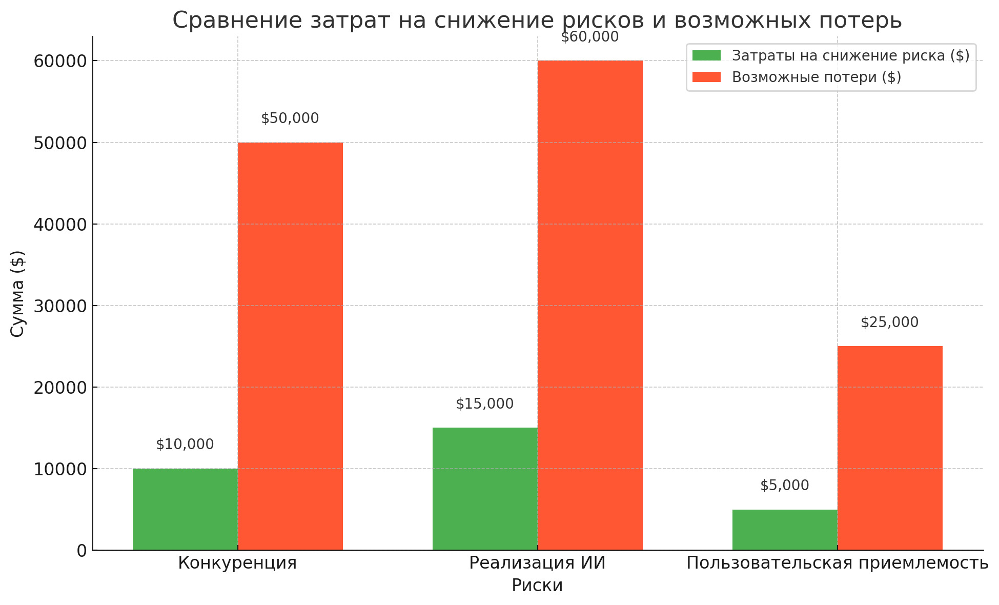
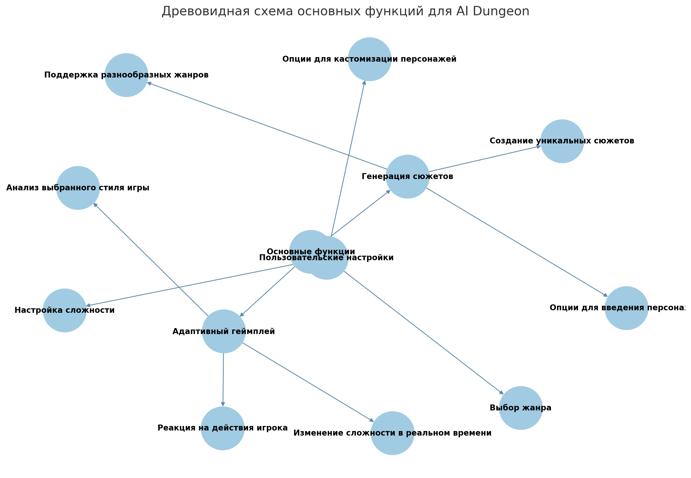

# Документ о концепции и границах #

## 1. Бизнес требования ##


### 1.1 Исходные данные ###

```
Приложение  AI Dungeon появилось в ответ на растущий интерес к интерактивным и творческим развлечениям,
 связанным с искусственным интеллектом.Сегодня пользователи ищут новые форматы досуга,
 которые не только развлекают, но и позволяют проявить креативность.
 Приложение предлагает уникальную возможность создания персонализированных текстовых приключений,
 где ИИ адаптируется к вводимым пользователем данным, помогая развивать сюжет. Это сочетание интерактивности
 и машинного обучения создает у пользователей эффект вовлеченности, так как они чувствуют,
 что создают уникальную историю вместе с ИИ.

- Потребности рынка:
  - Увеличение интереса к технологиям ИИ и их применению в повседневной жизни.
  - Высокий спрос на приложения для развития творческих навыков, такие как написание и генерация текста.
  - Популярность мобильных и десктопных приложений, способных адаптироваться к предпочтениям пользователя.
  - Интерес к интерактивному storytelling, который может быть как индивидуальным, так и многопользовательским.

- Целевая аудитория:
  - Молодежь и взрослые, интересующиеся ИИ, фантастикой и интерактивными играми.
  - Писатели и творческие профессионалы, стремящиеся улучшить свои навыки сочинения и найти новые идеи.
  - Люди, увлеченные текстовыми играми и ролевыми играми, ищущие платформу, где можно создать свои миры и сценарии.
```
Как пример, процент пользователей, готовый платить и использующие следующие нейросети:



### 1.2 Возможности бизнеса ###

```
AI Dungeon решает ключевую бизнес-задачу — создание пространства для интерактивного, пользовательского storytelling,
 управляемого искусственным интеллектом. Это востребованный формат на рынке развлекательных приложений
 и приложений для креативного взаимодействия с ИИ. Приложение занимает нишу текстовых игр,
 где пользователи получают возможность создавать уникальные истории, управляемые ИИ,
 и взаимодействовать с историей на индивидуальном уровне. 

Рынок и конкуренция:
 Продукт выходит на рынок интерактивных ИИ-приложений, где он конкурирует с другими решениями,
 такими как NovelAI или Replika, которые используют ИИ для создания персонализированного опыта.
В сравнении с аналогами AI Dungeon привлекает за счет гибкости повествования, возможности выбора жанра
 и многопользовательского режима, что делает его более привлекательным для широкого круга пользователей.

AI Dungeon предлагает уникальные преимущества:
- Персонализация и интерактивность: Пользователи могут создавать и изменять сюжетные линии в реальном времени,
 взаимодействуя с ИИ, что недоступно в большинстве других текстовых игр.
- Гибкость жанров: Возможность выбора и создания различных сценариев, от фэнтези до научной фантастики и детективов,
 что расширяет возможности для пользователей с разными интересами.
- Применение передовых технологий ИИ: Использование генеративных моделей для текста обеспечивает высокую степень
 адаптивности приложения и создает уникальный опыт для каждого пользователя.

Типичные клиенты AI Dungeon — это пользователи, стремящиеся к креативности, самовыражению
 и взаимодействию с новыми технологиями ИИ. Приложение ориентировано на аудиторию, заинтересованную в:
- Индивидуализированном опыте, в котором сюжет адаптируется под их выбор.
- Платформе для развития навыков письма и креативного мышления.
- Возможности социального взаимодействия в рамках создания историй (через многопользовательский режим).

Пример использования: Пользователь начинает с выбора жанра и задает вводные данные для истории.
 Затем ИИ адаптирует историю, развивая её согласно действиям пользователя. Это помогает каждому пользователю
 почувствовать себя автором уникальной сюжетной линии, что особенно ценно для людей,
 заинтересованных в текстовых играх и storytelling.

Критичные требования к качеству и интерфейсам
Продукт должен:
- Иметь интуитивный интерфейс, чтобы пользователи могли легко создавать и управлять сценариями.
- Обеспечивать высокое качество генерации текста ИИ, чтобы взаимодействие оставалось увлекательным и последовательным.
- Поддерживать быструю и стабильную работу, особенно в многопользовательском режиме.

Требования к интерфейсам:
- Поддержка нескольких платформ (веб и мобильные устройства) для удобства доступа.
- Возможность настраивать сюжетные элементы и жанры.
```


### 1.3 Бизнес-цели ###

```
Количественные финансовые цели:

Увеличение доли рынка: Занять X% рынка интерактивных ИИ-приложений в течение первых 12 месяцев
 после выпуска расширенной версии AI Dungeon, обеспечив конкурентоспособность
 на рынке storytelling-приложений и платформ для творчества.

Рост доходов от подписок: Обеспечить рост доходов от подписок на 30% в течение первого года
 за счет внедрения новых функций, доступных по подписке, включая доступ к более мощным ИИ-моделям,
 специальным жанрам и многопользовательским возможностям.

Партнерские программы: Заключить не менее X партнерств с компаниями или авторами контента
 в течение первых 6 месяцев после выхода обновления, что расширит предложение контента
 и привлечет новых пользователей за счет уникальных сюжетов.

Нефинансовые цели:

Уровень удовлетворенности пользователей: Достигнуть уровня удовлетворенности пользователей в 85%
 по данным опросов через 6 месяцев после запуска обновленной версии,
 что обеспечит стабильный пользовательский рост и удержание.

Повышение производительности и качества: Сократить время генерации текстов ИИ на 25%
 и снизить процент ошибок, связанных с некорректной генерацией текста, до менее 5%.
 Это повысит стабильность приложения и улучшит пользовательский опыт.

Создание семейства продуктов: Разработать основную платформу, которая будет поддерживать возможность создания
 связанных продуктов и дополнительных сервисов (например, продукт для образовательного storytelling,
 корпоративные решения для тренингов и обучения). Это позволит компании быстро масштабироваться
 и адаптировать технологии для новых рынков.
```

### 1.4 Изложение концепции ###

```
Успех AI Dungeon будет определяться заинтересованными сторонами (руководством, разработчиками,
 маркетингом, пользователями) по следующим критериям:

Рост пользовательской базы: Увеличение числа активных пользователей и расширение доли на рынке
 интерактивных ИИ-игр, что указывает на интерес к продукту и его конкурентоспособность.

Пользовательская удовлетворенность: Высокий уровень удовлетворенности пользователей и положительные отзывы,
 которые демонстрируют качество продукта и его соответствие ожиданиям пользователей.
 Этот фактор будет измеряться через опросы и рейтинг в магазинах приложений.

Стабильные доходы от подписок: Увеличение числа платных подписчиков и стабильный рост доходов,
 подтверждающий, что пользователи видят ценность в платных функциях продукта.

Репутация продукта: Продукт должен завоевать статус уникального и надежного инструмента для storytelling.
 Позитивная репутация будет измеряться через PR-публикации, упоминания в СМИ и рейтинги в магазинах приложений.

Расширяемость платформы: Способность платформы поддерживать последующее расширение
 или создание связанных продуктов, что увеличивает гибкость и адаптивность AI Dungeon к новым возможностям и рынкам.
Факторы, влияющие на успех
Контролируемые факторы:

Качество разработки и тестирования: Стабильность и отсутствие ошибок будут обеспечены за счет тщательного тестирования,
 оптимизации ИИ-модели и улучшения интерфейса.

Маркетинговая стратегия: Грамотное продвижение продукта и эффективное таргетирование аудитории,
 что будет помогать привлекать новых пользователей и повышать узнаваемость бренда.

Клиентская поддержка и обновления: Оперативная поддержка пользователей и регулярные обновления с новыми функциями,
 которые помогут удержать пользователей и стимулировать их к оформлению подписки.

Неконтролируемые факторы:

Конкуренция на рынке: Появление аналогичных ИИ-продуктов с более выгодными предложениями может повлиять на удержание пользователей.

Регулирование технологий ИИ: Изменения в законодательстве или политиках магазинов приложений относительно
 использования ИИ могут повлиять на доступность и развитие продукта.

Изменения пользовательских предпочтений: Интерес к интерактивным ИИ-играм может снижаться
 по мере изменения предпочтений аудитории, что может отразиться на темпах роста.
```


### 1.5 Бизнес-риски ###

```
Обзор ключевых бизнес-рисков и их возможного влияния

Высокая рыночная конкуренция
Описание риска: Рынок интерактивных ИИ-приложений для storytelling
 расширяется, и новые конкуренты могут предложить
 более мощные функции или бесплатные сервисы, что привлечет пользователей.
Возможные потери: Снижение доли рынка, потеря текущих и потенциальных пользователей.
Вероятность возникновения: Высокая.
Контроль: Частичный.
Меры смягчения: Инвестировать в уникальные функции AI Dungeon, не представленные
 у конкурентов (например, возможность выбора жанра
 и многопользовательский режим), а также обеспечивать высокую лояльность пользователей
 за счет качественной поддержки и регулярных обновлений.

Непредсказуемость пользовательских предпочтений
Описание риска: Изменения в предпочтениях аудитории могут привести к снижению интереса
 к интерактивным текстовым играм или ИИ-генерации сюжетов.
Возможные потери: Потеря активных пользователей и падение доходов.
Вероятность возникновения: Средняя.
Контроль: Низкий.
Меры смягчения: Проводить регулярные опросы пользователей, тестировать новые функции
 и адаптировать приложение под популярные запросы, чтобы оставаться актуальным на рынке.

Проблемы с реализацией высококачественной ИИ-модели
Описание риска: Использование ИИ-модели для генерации сложных сюжетов требует высокой
 вычислительной мощности и может быть дорогостоящим.
Возможные потери: Увеличение затрат на разработку и инфраструктуру, снижение доходности из-за роста расходов.
Вероятность возникновения: Высокая.
Контроль: Средний.
Меры смягчения: Оптимизировать ИИ-модель, снижать вычислительные затраты без потери качества и искать альтернативные технологии.

Проблемы с законодательным регулированием ИИ
Описание риска: Изменения в законодательстве или новые регуляции в области искусственного интеллекта
 могут ограничить использование или разработку генеративных моделей.
Возможные потери: Ограничение возможностей продукта, потеря аудитории и необходимость значительных изменений в продукте.
Вероятность возникновения: Средняя.
Контроль: Низкий.
Меры смягчения: Следить за правовыми изменениями в области ИИ и разрабатывать стратегию адаптации продукта
 для минимизации влияния регулирования.

Отрицательная пользовательская приемлемость и негативные отзывы
Описание риска: Низкая приемлемость у пользователей из-за недостатков в ИИ или технических проблем может привести
 к негативным отзывам и снижению рейтинга в магазинах приложений.
Возможные потери: Потеря репутации, отток пользователей и снижение продаж.
Вероятность возникновения: Средняя.
Контроль: Высокий.
Меры смягчения: Улучшать стабильность ИИ, оперативно решать возникающие технические проблемы и работать
 с отзывами, чтобы повысить пользовательскую лояльность.
```
График затрат на снижение рисков: 


### 1.6 Предположения и зависимости ###

```
Важнейшие зависимости проекта

Зависимость от сторонних поставщиков ИИ-технологий
Описание: Продукт зависит от сторонних поставщиков, предоставляющих языковые модел
и и вычислительные мощности, что необходимо для генерации качественного текста.
Возможные риски: В случае изменения политики поставщиков или роста цен могут возникнуть задержки
 и дополнительные расходы. Это также повышает риски, связанные с устойчивостью и стабильностью продукта.

Зависимость от платформ для распространения (магазины приложений)
Описание: Распространение и доступность AI Dungeon зависят от магазинов приложений (Google Play, App Store),
 которые могут изменять свои правила, что отразится на продукте.
Возможные риски: В случае изменения политики магазинов (например, ограничения
 на использование ИИ-технологий) продукт может быть удален или ограничен в доступности, что приведет к снижению охвата аудитории.

Поддержка внешних маркетинговых и PR-кампаний
Описание: Продукт зависит от успешности маркетинговых и PR-кампаний для привлечения
 новой аудитории и удержания существующей.
Возможные риски: Если маркетинговые компании окажутся неэффективными или рынок покажет
 низкий отклик, это может затруднить привлечение целевой аудитории и снизить темпы роста доходов.

Изменения в предпочтениях пользователей и рыночных трендах
Описание: Продукт находится в зависимости от предпочтений пользователей, которые могут
 изменяться под воздействием новых технологий и трендов.
Возможные риски: Если популярность интерактивных текстовых игр снизится или появятся
 альтернативные технологии для креативного взаимодействия, это может повлиять на удержание пользователей.
```

## 2. Рамки и ограничения проекта ##

### 2.1 Основные функции ###




### 2.2 Объем первоначально запланированной версии ###

```
Основные функции первой версии:

Основная генерация текстового контента:
Обеспечивает базовую генерацию текстов с помощью ИИ, отвечая
 на запросы пользователей и создавая интерактивный сюжет.

Базовый интерфейс взаимодействия:
Простой и понятный интерфейс для ввода текста пользователями
 и вывода ответов ИИ, обеспечивающий комфортное взаимодействие с системой.

Настройки персонажа и жанра:
Набор базовых опций для выбора характера персонажа, жанра
 истории (фэнтези, научная фантастика и т.д.), что позволяет пользователям настраивать игровой процесс под свои предпочтения.

Система ограничений по количеству использований:
Включает фиксированное количество бесплатных генераций текста для
 пользователей первой версии, что поможет оценить востребованность продукта и потенциал для введения премиальных функций.

Ограниченный язык интерфейса:
На этапе первой версии поддерживается только английский язык,
 что минимизирует затраты на локализацию и упрощает начальную разработку.

Базовые метрики качества:
1. Скорость генерации ответов
Описание: Среднее время, которое требуется ИИ для генерации
 ответного текста после ввода запроса пользователем.
Целевое значение: Ответы должны генерироваться в течение 2-3 секунд.
 Уменьшение времени генерации увеличивает удовлетворенность пользователей
 и делает взаимодействие с приложением более плавным.

2. Стабильность и надежность сервера
Описание: Количество сбоев и перезагрузок сервера в течение определенного периода.
Целевое значение: Доля стабильной работы должна составлять
 не менее 99.5% времени в неделю (время без сбоев).
Значение для пользователей: Высокая стабильность обеспечивает
 надежный доступ к приложению, снижая риск разочарования и потери пользователей.

3. Интерактивность и отзывчивость интерфейса
Описание: Время реакции интерфейса на действия пользователя,
 включая нажатия кнопок, ввод текста и т.д.
Целевое значение: Реакция интерфейса должна происходить менее
 чем за 0.5 секунд на каждое действие.
Значение для пользователей: Быстрая отзывчивость поддерживает
 вовлеченность и улучшает общее восприятие продукта.

4. Стабильность генерации сюжета (минимизация ошибок ИИ)
Описание: Частота случаев, когда ИИ выдает неполный или несвязный текст,
 который мешает прогрессу в игре.
Целевое значение: Не более 5% от всех генераций должны содержать ошибки
 или несоответствия, которые мешают продолжению сюжета.
Значение для пользователей: Снижение количества ошибок ИИ поддерживает
 интерес и доверие к продукту.

5. Показатели задержек и сбоев при высокой нагрузке
Описание: Изменения в скорости генерации ответов и частота сбоев при
 одновременном использовании продукта большим количеством пользователей.
Целевое значение: Время ответа не должно увеличиваться более чем на 20% при
 возрастании нагрузки до пиковых значений.
Значение для пользователей: Поддержание производительности в часы высокой
 нагрузки обеспечивает стабильность и позволяет продукту справляться с популярностью.
```

### 2.3 Объем последующих версии ###

```
Если вы ожидаете поэтапную эволюцию продукта или если используете ите-
ративную модель разработки, создайте план выпуска, в котором укажите, ка-
кие функции будут отложены и желательные сроки последующих выпусков.
В последующих версиях вы сможете реализовать дополнительные варианты
использования и функции и расширить возможности первоначальных ва-
риантов использования и функций. Чем дальше вы заглядываете, тем более
расплывчатыми будут границы проекта. Вам наверняка придется передви-
нуть функциональность с одного запланированного выпуска до другого и,
возможно, добавлять незапланированные функции. Короткие циклы выпу-
сков часто предоставляют удобные случаи для накопления знаний, основан-
ных на отзывах клиентов.

В некоторых случаях бывает удобно объединять пункты "Объем первоначально 
запланированной версии" и "Объем последующих версий" в единую таблицу. Пример:
```

| Функции                             | Выпуск 1                                                                                                       | Выпуск 2                                             | Выпуск 3                                             |
|-------------------------------------|----------------------------------------------------------------------------------------------------------------|------------------------------------------------------|------------------------------------------------------|
| FE-1. Создание текстовых  историй   | Базовая генерация текста                                                                                       | Улучшенная генерация, меньший процент ошибок         | Продвинутая генерация с адаптивным контекстом        |
| FE-2. Режим игры                    | Один стандартный режим                                                                                         | Добавление мультиплеера и кооперативного режима      | Режимы: "Выживание", "Песочница"                     |
| FE-3. Настройки персонажа           | Базовые характеристики персонажа                                                                               | Расширенные опции кастомизации                       | Профильный редактор с индивидуальными чертами        |
| FE-4. Выбор жанра                   | Только фэнтези                                                                                                 | Научная фантастика и исторический жанр               |  Режимы "Детектив", "Приключение"                    |
| FE-5. Сохранение и загрузка сессий  | Локальное сохранение                                                                                           | Облачное сохранение                                  |   Совместное сохранение для командной игры           |
| FE-6. Приложение на устройствах     | Версия для iOS и Android                                                                                       | Поддержка для планшетов                              | Поддержка Windows Phone                              |

### 2.4 Ограничения и исключения ###

```
Перечислите все возможности или характеристики, которых могут ожидать
заинтересованные в проекте лица, но включение которых в продукт или в
определенную версию не запланировано. Перечислите изъятые элементы,
чтобы не забыть решения по границам проекта. Если пользователь запросил
возможность доступа к системе с телефона, когда он не находится на рабочем
месте, и эта функция была признанной не входящей в границы проекта, тогда
четко запишите в соответствующем разделе: «Новая система не поддержива-
ет доступа с мобильных устройств».
```

## 3. Бизнес-контекст ##

```
В этом разделе представлены профили основных категорий заинтересован-
ных лиц, приоритеты руководства в проекте, а также сводка некоторых обсто-
ятельств, которые надо учесть при планировании развертывания решения.
```

### 3.1 Профили заинтересованных лиц ###

```
Заинтересованными в проекте лицами (stakeholders) называются отдельные
лица, группы или организации, которые активно вовлечены в проект, на кото-
рых влияет результат проекта и которые сами могут влиять на этот результат.
Профили заинтересованных лиц описывают различные категории клиентов и 
других ключевых лиц, заинтересованных в этом проекте. Вам не нужно 
описывать каждую группу заинтере сованных лиц, например юристов, которые 
должны проверять соответствие надлежащим законам. Сферой вашего интереса 
должны стать различные группы клиентов, целевые рыночные сегменты и 
различные классы пользователей, входящих в эти сегменты. В профиль каждого
 заинтересованного в проекте лица включается следующая информация:

*  основная ценность или преимущество, которое продукт принесет заин-
    тересованным лицам, и то, как продукт удовлетворит покупателей. Цен-
    ность для заинтересованных лиц представляют:
    - повышенная производительность;
    - меньшее количество переделок;
    - снижение себестоимости;
    - ускорение бизнес-процессов;
    - автоматизация задач, ранее выполнявшихся вручную;
    - возможность выполнять совершенно новые задачи;
    - соответствие соответствующим стандартам и правилам;
    - лучшая, по сравнению с текущими продуктами, легкость и простота ис-
    пользования;
*   их вероятное отношение к продукту;
*   самые важные для них функции и характеристики;
*   все известные ограничения, которые должны быть соблюдены.

Можно включить поименный список ключевых заинтересованных лиц
  для каждого профиля или структурную схему организации, показывающую
  отношения между заинтересованными лицами в организации.
  
Пример профиля заинтересованных лиц (ПО заказа блюд):
```

| Заинтересованное лицо        | Основная ценность                                                                                           | Отношение                                                                                                                           | Основные интересы                                                                             | Ограничения                                                                                                           |
|------------------------------|-------------------------------------------------------------------------------------------------------------|-------------------------------------------------------------------------------------------------------------------------------------|-----------------------------------------------------------------------------------------------|-----------------------------------------------------------------------------------------------------------------------|
| Руководство компании         | Увеличение производительности труда сотрудников; сокращение затрат в кафетерии                              | Сильная поддержка вплоть до выпуска 2; поддержка выпуска 3, в зависимости от результатов предыдущих выпусков                        | Экономия расходов должна превысить затраты на разработку и использование                      | Не определены                                                                                                         |
| Сотрудники кафетерия         | Более эффективное использование рабочего времени сотрудников в течение дня; большее удовлетворение клиентов | Озабоченность взаимоотношениями с профсоюзом и возможным сокращением персонала; в остальном — все воспринимается нормально          | Сохранение рабочих мест                                                                       | Необходимость обучения сотрудников работе с Интернетом; необходимость в персонале и транспорте для доставки           |
| Постоянные клиенты кафетерия | Лучший выбор блюд; экономия времени; удобство                                                               | Большой энтузиазм, но могут использовать систему меньше, чем ожидается, из-за социальной значимости обедов в кафетерии и ресторанах | Простота использования; надежность доставки; возможность выбора блюд                          | Необходимость доступа к корпоративной интрасети, к Интернету или требуется мобильное устройство                       |
| Отдел расчета зарплаты       | Отсутствие какой-либо выгоды; необходимость создания схемы удержания стоимости заказов из зарплаты          | Не особо счастливы относительно предстоящей работы над ПО, но понимают ценность для компании и сотрудников                          | Минимум изменений в текущих приложениях расчета зарплаты                                      | Еще не выделено никаких ресурсов на изменение ПО                                                                      |
| Менеджеры ресторанов         | Увеличение продаж; выходна новые области рынка для привлечения новых клиентов                               | Увеличение продаж; выход на новые области рынка для привлечения новых клиентов                                                      | Минимум новых технологий; озабоченность ресурсами и затратами, необходимыми для доставки блюд | Могут не иметь персонала и возможностей для обработки нужных объемов заказов; не у всех меню представлены в Интернете |


### 3.2 Приоритеты проекта ###

```
Чтобы принимать эффективные решения, заинтересованные лица должны
договориться о приоритетах проекта. Один из подходов к этому заключается
в рассмотрении пяти измерений: функции (или объем), качество, график, за-
траты и кадры. В любом проекте каждое из этих измерений
относится к одной из трех категорий:

* ограничение — сдерживающий фактор, в рамках которого должен опери-
ровать менеджер проекта;
* ведущий фактор — важный фактор успеха, ограниченно гибкий при из-
менениях;
* степень свободы — возможность для менеджера проекта до определен-
ной степени менять измерение и балансировать относительно других из-
мерений.
```

### 3.3 Особенности развертывания ###

```
Перечислите информацию и действия, необходимые для обеспечения эф-
фективного развертывания решения в рабочую среду. Опишите доступ, ко-
торый потребуется пользователями для работы с системой, в частности, на-
ходятся ли они далеко в разных часовых поясах или недалеко друг от друга.
Укажите, когда пользователям в разных местах нужен доступ к системе. Если
требуются изменения инфраструктуры, чтобы обеспечить потребности ПО в
мощностях, доступе к сети, хранилищу данных и миграции данных, опишите
эти изменения. Зафиксируйте всю информацию, которая потребуется тем,
кто будет готовить бизнес-процессы обучения и модификации в связи с раз-
вертыванием нового решения.

Пример:

ПО веб-сервера нужно обновить до последней версии. В рамках второго вы-
пуска нужно разработать приложения для смартфорнов и планшетов под
управлением iOS и Android, а в третьем выпуске нужно выпустить приложе-
ния для смартфонов и планшетов с Windows Phone. К моменту готовности
второго выпуска все соответствующие изменения должны быть выполнены.
Нужно разработать видеоролики длительностью не более пяти минут, обу-
чающие пользователей работе с интернет-версией и приложениями системы
Cafeteria Ordering System.
```
